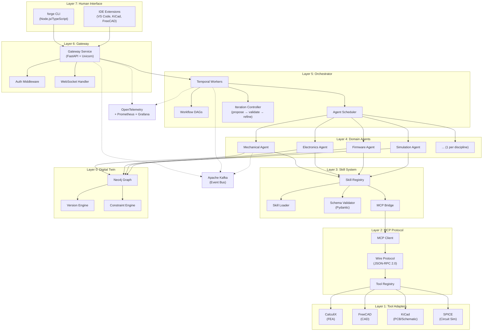
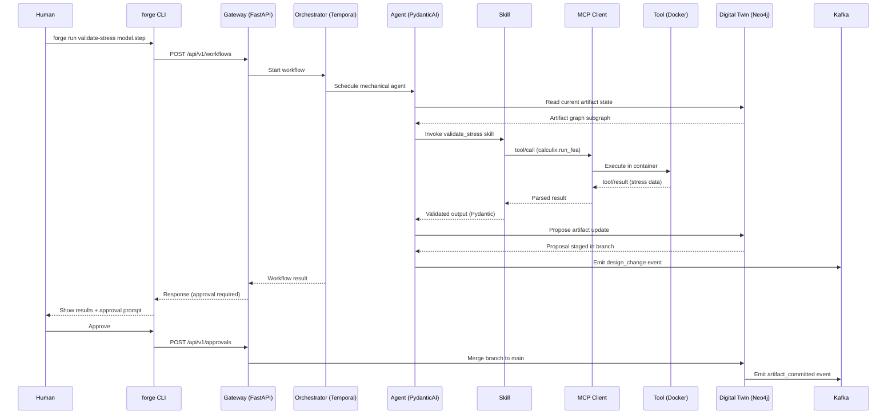

# MetaForge System Architecture

> **Version**: 0.1 (Phase 0 — Spec & Design)
> **Status**: Draft
> **Last Updated**: 2026-03-02

## 1. Overview

MetaForge is a **local-first control plane** that turns human intent into reviewable, manufacturable hardware artifacts. It orchestrates specialist AI agents — one per engineering discipline — that interface with real engineering tools (KiCad, FreeCAD, CalculiX, SPICE) to produce schematics, BOMs, PCB layouts, firmware scaffolds, manufacturing files, and test plans.

### Prime Rule

> If it can't be versioned, reviewed, and built — MetaForge doesn't output it.

### Architectural Invariants

These five rules are non-negotiable across all phases:

1. **Agents never call tools directly** — all tool access goes through the MCP protocol layer.
2. **Digital Twin owns all state** — agents read from and propose changes to the Twin; they do not maintain their own state.
3. **Human-in-the-loop** — read-only by default; explicit approval is required for any write operation.
4. **Skills are the atomic unit** — every agent capability is a deterministic, schema-validated, independently testable skill.
5. **Git-native** — every artifact is versioned, diffable, and reviewable. No opaque blobs.

---

## 2. Technology Stack

| Component | Technology | Notes |
|-----------|-----------|-------|
| Primary Language | Python 3.11+ | Gateway, Agents, Twin, Skills, MCP |
| CLI / Dashboard | Node.js / TypeScript | CLI only (`forge` binary) |
| CLI Libraries | Commander.js, Inquirer, Chalk | Interactive terminal UX |
| Gateway | FastAPI + Uvicorn | HTTP/WebSocket API server |
| Agent Framework | PydanticAI + Temporal | ADR-001: structured agent outputs + durable workflows |
| LLM Providers | `openai` + `anthropic` SDKs | Unified abstraction layer |
| Validation | Pydantic v2 | All schemas, configs, messages |
| Workflow Engine | Temporal (Python SDK) | Durable execution, retries, sagas |
| Graph Database | Neo4j | Digital Twin artifact graph |
| Event Bus | Apache Kafka | Design change events, audit log |
| Observability | OpenTelemetry + structlog | Traces, metrics, structured logs |
| Monitoring | Prometheus + Grafana | Dashboards, alerts |
| Containerization | Docker | Tool adapter isolation |

### ADR-001: PydanticAI + Temporal

The agent framework decision (ADR-001) selects **PydanticAI** for structured LLM interactions (type-safe tool definitions, validated outputs, dependency injection) and **Temporal** for workflow orchestration (durable execution, retry policies, saga patterns). This combination replaces the originally planned custom orchestration layer.

- **PydanticAI** handles: agent definition, tool registration, structured output parsing, LLM provider abstraction.
- **Temporal** handles: workflow DAGs, agent coordination, timeout/retry policies, long-running design loops, state persistence.

---

## 3. System Architecture

### 7-Layer Stack

```
┌─────────────────────────────────────────────────┐
│  Layer 7: Human Interface                       │
│  CLI (forge) · IDE Extensions · Approval UI     │
├─────────────────────────────────────────────────┤
│  Layer 6: Gateway Service (FastAPI)             │
│  HTTP/WebSocket API · Auth · Rate Limiting      │
├─────────────────────────────────────────────────┤
│  Layer 5: Orchestrator (Temporal)               │
│  Workflow DAGs · Agent Scheduling · Iteration   │
├─────────────────────────────────────────────────┤
│  Layer 4: Domain Agents (PydanticAI)            │
│  1 agent per discipline · Skill invocation      │
├─────────────────────────────────────────────────┤
│  Layer 3: Skill System                          │
│  Registry · Loader · Schema Validation · Bridge │
├─────────────────────────────────────────────────┤
│  Layer 2: MCP Protocol Layer                    │
│  Client · Wire Protocol · Tool Registry         │
├─────────────────────────────────────────────────┤
│  Layer 1: Tool Adapters (Docker)                │
│  KiCad · FreeCAD · CalculiX · SPICE             │
├─────────────────────────────────────────────────┤
│  Layer 0: Digital Twin (Neo4j)                  │
│  Artifact Graph · Versioning · Constraints      │
└─────────────────────────────────────────────────┘
```

### Architecture Diagram



---

## 4. Dual-Mode Operation

MetaForge supports two operational modes that determine the design loop behavior:

### Assistant Mode (Default)

The human drives the design process. MetaForge validates and advises.

```
Human edits design files
        │
        ▼
  File watcher detects changes
        │
        ▼
  Agents validate post-edit
        │
        ▼
  Results shown in IDE / CLI
        │
        ▼
  Human reviews and iterates
```

- All tool operations are **read-only** by default.
- Validation runs automatically on file changes.
- Agents flag issues but do not modify files without explicit approval.
- Approval gates: per-file, per-agent, or per-session granularity.

### Autonomous Mode

AI agents drive the design loop. Humans review at gate checkpoints.

```
Human provides PRD + constraints
        │
        ▼
  Orchestrator creates workflow DAG
        │
        ▼
  Agents execute: propose → validate → refine
        │
        ▼
  Gate checkpoint: human reviews
        │
        ▼
  Approved → commit to Twin
  Rejected → agents refine
```

- Agents can propose file modifications (writes go through approval).
- The propose → validate → refine loop runs until constraints pass or iteration limit is reached.
- Gate checkpoints are configurable: per-step, per-phase, or end-of-workflow.
- All proposed changes are staged in a Twin branch before approval.

---

## 5. Component Descriptions

### 5.1 Gateway Service (Layer 6)

**Technology**: FastAPI + Uvicorn

The Gateway is the "front door" — the single entry point for all client interactions.

| Responsibility | Details |
|---------------|---------|
| HTTP API | RESTful endpoints for project CRUD, agent status, Twin queries |
| WebSocket | Real-time agent progress, validation results, approval requests |
| Authentication | API key + JWT token-based auth |
| Rate Limiting | Per-client request throttling |
| Request Routing | Dispatches to Temporal workflows or direct Twin queries |

### 5.2 Orchestrator (Layer 5)

**Technology**: Temporal (Python SDK)

The Orchestrator is the "brain" — it coordinates multi-agent workflows as durable Temporal workflows.

| Responsibility | Details |
|---------------|---------|
| Workflow DAGs | Define agent execution order based on dependency graphs |
| Agent Scheduling | Queue and dispatch agent tasks with priority |
| Iteration Control | Manage the propose → validate → refine loop |
| Dependency Resolution | Determine inter-agent data dependencies |
| Failure Handling | Retry policies, compensation (saga pattern), timeout management |
| State Persistence | Temporal handles workflow state durably across restarts |

### 5.3 Domain Agents (Layer 4)

**Technology**: PydanticAI

Each agent is a specialist for exactly one engineering discipline (1:1 ratio). Agents are implemented as PydanticAI agents with typed tool definitions and structured outputs.

| Property | Details |
|----------|---------|
| Ratio | 1 agent : 1 discipline |
| Implementation | PydanticAI `Agent` class with domain-specific system prompt |
| Tools | Skills registered as PydanticAI tools via the Skill Registry |
| State | Stateless — all persistent state lives in the Digital Twin |
| Communication | Via Temporal workflows (agent-to-agent) and Kafka events |

### 5.4 Skill System (Layer 3)

**See**: [`docs/skill_spec.md`](skill_spec.md)

Skills are the atomic unit of domain expertise. Each skill is deterministic, schema-validated, and independently testable.

| Property | Details |
|----------|---------|
| Definition | 5-file directory: `definition.json`, `SKILL.md`, `schema.py`, `handler.py`, `tests.py` |
| Validation | Pydantic models for input/output schemas |
| Registry | Auto-discovery + manual registration |
| MCP Bridge | Skills invoke tools exclusively through the MCP protocol |

### 5.5 MCP Protocol Layer (Layer 2)

**See**: [`docs/mcp_spec.md`](mcp_spec.md)

The Model Context Protocol layer provides the wire protocol for all tool access. No agent or skill ever calls an engineering tool directly.

| Property | Details |
|----------|---------|
| Protocol | JSON-RPC 2.0 over stdio (local) or HTTP (remote) |
| Messages | `tool/list`, `tool/call`, `tool/result`, `tool/error`, `health/check` |
| Registry | Tool catalog with capability declarations and health tracking |
| Execution | Invocation lifecycle with timeout, retry, and cleanup |

### 5.6 Tool Adapters (Layer 1)

Tool adapters wrap engineering tools in MCP-compatible servers. Each adapter runs in an isolated Docker container.

| Adapter | Tool | Phase | Capabilities |
|---------|------|-------|-------------|
| CalculiX | FEA solver | Phase 1 | Mesh validation, stress analysis, thermal analysis |
| FreeCAD | CAD modeler | Phase 1 | Geometry export, STEP/STL conversion, measurement |
| KiCad | PCB/Schematic | Phase 1 (read-only), Phase 2 (write) | ERC, DRC, BOM export, Gerber export |
| SPICE | Circuit sim | Phase 1 | DC/AC analysis, transient simulation |

### 5.7 Digital Twin (Layer 0)

**See**: [`docs/twin_schema.md`](twin_schema.md)

The Digital Twin is the single source of design truth — a versioned artifact graph stored in Neo4j.

| Property | Details |
|----------|---------|
| Storage | Neo4j graph database |
| Nodes | Artifact, Constraint, Version, Component, Agent |
| Edges | DEPENDS_ON, IMPLEMENTS, VALIDATES, CONTAINS, etc. |
| Versioning | Git-like branching model for the graph |
| Constraints | Cross-domain constraint engine with rule evaluation |
| API | CRUD, query, version, and constraint operations |

---

## 6. Data Flow

### Request Lifecycle



### Propose → Validate → Refine Loop

The core iteration loop used in Autonomous Mode:

```
┌──────────────────────────────────────────────┐
│                                              │
│  ┌─────────┐    ┌──────────┐    ┌─────────┐ │
│  │ PROPOSE │───▶│ VALIDATE │───▶│ REFINE  │ │
│  └─────────┘    └──────────┘    └─────────┘ │
│       ▲                              │       │
│       │         Constraints          │       │
│       │           failed             │       │
│       └──────────────────────────────┘       │
│                                              │
│              Constraints pass                │
│                     │                        │
│                     ▼                        │
│              ┌────────────┐                  │
│              │ GATE CHECK │                  │
│              └────────────┘                  │
│                     │                        │
│              Human approves                  │
│                     │                        │
│                     ▼                        │
│              ┌────────────┐                  │
│              │   COMMIT   │                  │
│              └────────────┘                  │
└──────────────────────────────────────────────┘
```

1. **Propose**: Agent generates or modifies artifacts using skills.
2. **Validate**: Constraint engine checks all cross-domain rules against the proposed state.
3. **Refine**: If constraints fail, the agent receives violation details and iterates. Max iterations are configurable (default: 5).
4. **Gate Check**: Once constraints pass, the proposal is presented for human review (in Autonomous Mode) or auto-committed (if pre-approved).
5. **Commit**: Approved changes are merged from the Twin branch into the main branch.

---

## 7. Observability Stack

| Layer | Technology | Purpose |
|-------|-----------|---------|
| Traces | OpenTelemetry (OTLP) | Distributed tracing across Gateway → Orchestrator → Agent → Tool |
| Logs | structlog | Structured JSON logging with correlation IDs |
| Metrics | Prometheus | Agent latency, skill success rates, tool invocation counts |
| Dashboards | Grafana | Real-time system health, workflow progress |

### Trace Context Propagation

Every request receives a trace ID at the Gateway. This ID propagates through:

- Temporal workflow context
- PydanticAI agent invocations
- MCP tool calls
- Kafka event headers
- Neo4j transaction metadata

This enables end-to-end tracing from human intent to tool execution.

---

## 8. Monorepo Structure

Each top-level directory maps to an architectural layer:

```
MetaForge/
├── cli/                        # Layer 7: CLI commands (Node.js/TypeScript)
│   ├── index.ts                # Main entry point
│   └── commands/               # Command implementations
│
├── api_gateway/                # Layer 6: Gateway Service (FastAPI)
│   ├── app.py                  # FastAPI application
│   ├── routes/                 # API route handlers
│   ├── middleware/             # Auth, rate limiting, CORS
│   └── websocket/              # WebSocket handlers
│
├── orchestrator/               # Layer 5: Coordination engine (Temporal)
│   ├── workflows/              # Temporal workflow definitions
│   ├── activities/             # Temporal activity implementations
│   ├── worker.py               # Temporal worker entry point
│   └── scheduler.py            # Agent execution queuing
│
├── twin_core/                  # Layer 0: Digital Twin (Neo4j)
│   ├── models/                 # Pydantic models (Artifact, Constraint, etc.)
│   ├── graph_engine.py         # Neo4j CRUD + traversal
│   ├── versioning/             # Branch, merge, diff operations
│   ├── constraint_engine/      # Cross-domain constraint validation
│   └── api.py                  # Public Twin API
│
├── skill_registry/             # Layer 3: Skill management
│   ├── registry.py             # Skill catalog with auto-discovery
│   ├── loader.py               # Dynamic import + validation
│   ├── schema_validator.py     # Pydantic schema enforcement
│   ├── skill_base.py           # Abstract base class (SkillBase)
│   └── mcp_bridge.py           # Skill → MCP protocol bridge
│
├── domain_agents/              # Layer 4: One agent per discipline
│   ├── mechanical/             # Mechanical Engineering agent
│   ├── electronics/            # Electronics Engineering agent
│   ├── firmware/               # Embedded Software agent
│   └── simulation/             # Simulation & Validation agent
│
├── mcp_core/                   # Layer 2: MCP protocol client
│   ├── client.py               # MCP client implementation
│   ├── protocol.py             # JSON-RPC 2.0 wire protocol
│   └── schemas.py              # Pydantic message schemas
│
├── tool_registry/              # Layer 1: MCP tool servers (Docker)
│   ├── registry.py             # Tool catalog + health tracking
│   ├── execution_engine.py     # Invocation, timeout, retry
│   └── tools/                  # Individual tool adapters
│       ├── calculix/           # FEA analysis
│       ├── freecad/            # CAD operations
│       ├── kicad/              # PCB/schematic validation
│       └── spice/              # Circuit simulation
│
├── ide_assistants/             # Layer 7: IDE integrations
│   ├── vscode_extension/       # VS Code (firmware development)
│   ├── pcb_extension/          # KiCad plugin
│   └── cad_extension/          # FreeCAD plugin
│
├── tests/                      # Cross-cutting tests
│   ├── unit/
│   ├── integration/
│   └── e2e/
│
├── examples/                   # Reference projects
│   └── drone-fc/               # Drone flight controller (first demo)
│
└── docs/                       # Specification documents
    ├── architecture.md          # This document
    ├── twin_schema.md           # Digital Twin graph schema
    ├── skill_spec.md            # Skill system specification
    ├── mcp_spec.md              # MCP protocol specification
    ├── roadmap.md               # Phased delivery roadmap
    └── governance.md            # Contribution & governance
```

---

## 9. User Project Structure

When a user runs `forge setup`, MetaForge creates this structure for their hardware project:

```
project/
├── PRD.md                      # Human intent (product requirements)
├── constraints.json            # Design rules and constraints
├── decisions.md                # Design decisions log
├── eda/kicad/                  # Schematic + PCB files
├── bom/                        # BOM, alternates, costing
├── firmware/src/               # Firmware source + pinmap.json
├── manufacturing/              # Gerbers, pick & place
├── tests/bringup.md            # Bring-up checklists
└── .forge/
    ├── config.toml             # Project configuration
    ├── sessions/               # Agent session records
    └── traces/                 # Execution traces (OpenTelemetry)
```

This structure is version-controlled in Git. Every file produced by MetaForge is diffable and reviewable.

---

## 10. Security & Isolation Model

### Tool Isolation

All tool adapters run in Docker containers with strict isolation:

| Control | Implementation |
|---------|---------------|
| Filesystem | Bind-mounted workspace directory (read-only by default) |
| Network | No external network access (host-only) |
| Resources | CPU and memory limits per container |
| Lifecycle | Containers are ephemeral — created per invocation, destroyed after |
| Secrets | No secrets passed to tool containers |

### Human-in-the-Loop

| Operation | Default | Override |
|-----------|---------|----------|
| Read artifacts | Allowed | — |
| Run validation | Allowed | — |
| Modify artifacts | Blocked | Requires explicit approval |
| Commit to Twin | Blocked | Requires explicit approval |
| Execute tools | Allowed (sandboxed) | — |

### Data Locality

MetaForge is local-first:

- All design data stays on the user's machine.
- LLM API calls send only the minimum context needed (skill inputs, not full project files).
- No telemetry is sent without explicit opt-in.
- The Digital Twin graph is a local Neo4j instance.

---

## 11. Terminology Glossary

| Term | Definition |
|------|-----------|
| **Gateway Service** | FastAPI HTTP/WebSocket API server — the "front door" for all client interactions |
| **Orchestrator** | Temporal-based coordination engine — the "brain" that manages workflow DAGs |
| **Domain Agent** | PydanticAI agent for one engineering discipline (1:1 ratio) |
| **Skill** | Atomic unit of domain expertise — deterministic, schema-validated, independently testable |
| **Digital Twin** | Neo4j artifact graph — single source of design truth |
| **MCP** | Model Context Protocol — JSON-RPC 2.0 wire protocol for tool access |
| **Tool Adapter** | Docker-containerized wrapper that exposes an engineering tool via MCP |
| **Artifact** | Any design output: schematic, BOM, PCB layout, firmware source, test plan, etc. |
| **Constraint** | A rule that must be satisfied across artifacts (e.g., voltage rail ≤ 3.3V) |
| **Twin Branch** | A named snapshot of the artifact graph for isolated changes (like a Git branch) |
| **Gate Checkpoint** | A point in a workflow where human approval is required before proceeding |
| **PRD** | Product Requirements Document — the human intent that drives a design session |
| **Assistant Mode** | Human-driven design with post-edit validation (default mode) |
| **Autonomous Mode** | AI-driven design with propose → validate → refine loop |
| **Propose → Validate → Refine** | Core iteration loop: agent proposes changes, constraints validate, agent refines on failure |
